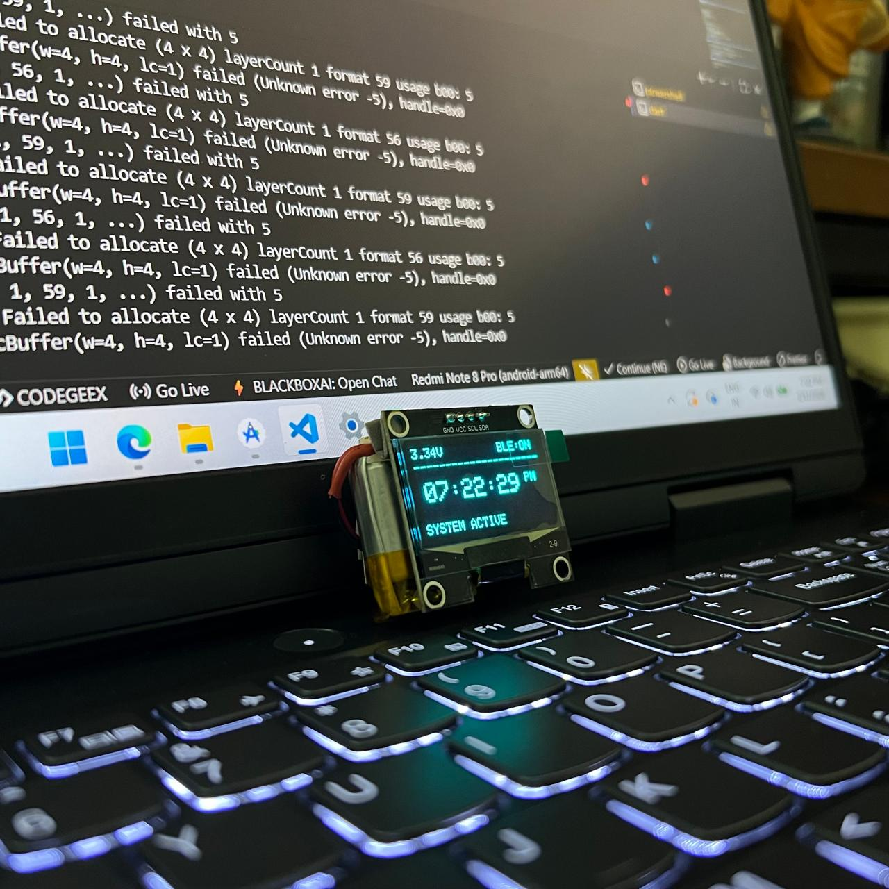

# BLE Smart Watch -- nRF52840 Sense Based Wearable System

  

## Project Overview

This project is a custom-designed BLE-enabled smart watch built using the Seeed Studio XIAO nRF52840 Sense.
The smart watch connects to a smartphone via Bluetooth Low Energy (BLE) to synchronize time, receive notifications,
and provide silent haptic alerts.

To improve usability and battery life, the system uses IMU-based motion detection for intelligent display control
and includes a multi-function push button for user interaction.

---

## Key Features

- BLE 5.0 based smartphone connectivity
- Automatic time synchronization from smartphone
- Incoming call notifications
- WhatsApp notifications
- Instagram notifications
- IMU-based wrist raise detection to wake OLED display
- Power-efficient display control
- Always-On Display (AOD) mode support
- Manual display mode switching using push button
- Multiple watch face support
- Haptic (vibration) feedback for notifications and button actions
- Silent physical alerts using vibration motor

---

## Hardware Components

- Microcontroller: Seeed Studio XIAO nRF52840 Sense
- SoC: Nordic nRF52840 (ARM Cortex-M4F with BLE 5.0)
- Display: 1.3-inch I2C OLED
- IMU: Built-in 6-axis motion sensor (on-board)
- Battery: 3.7V 400mAh Li-ion
- Input Device: Push Button
- Motor Driver: NPN Transistor with base resistor
- Notification Output: Vibration Motor

---

## System Architecture

### BLE Configuration
- Smart Watch: BLE Peripheral
- Smartphone Application: BLE Central

### Communication Flow
1. Smartphone scans and connects to the smart watch.
2. Time synchronization data is transmitted.
3. Notification data is sent through BLE characteristics.
4. Watch processes data and:
   - Updates OLED display
   - Activates vibration motor

---

## Display & Power Optimization Strategy

### IMU-Based Display Control
- Wrist raise detected → OLED turns ON
- No movement timeout → OLED turns OFF

### Push Button Functionality
- Toggle between Always-On Display and IMU-based screen wake-up
- Switch between multiple watch faces
- Haptic feedback on each valid button interaction

---

## Mobile Application

The custom mobile application provides:
- BLE scan and connection
- Real-time clock synchronization
- Call notifications
- WhatsApp notifications
- Instagram notifications
- Device connection management

---

## Working Principle

1. Watch powers ON using a 3.7V 400mAh Li-ion battery.
2. BLE connection is established with the smartphone.
3. Time is synchronized automatically.
4. Notifications are received and displayed.
5. Vibration motor activates for alerts and button feedback.
6. IMU controls display wake-up.
7. Push button manages display mode and watch faces.

---

## Future Improvements

- Battery level monitoring
- Message preview scrolling
- Custom watch faces
- OTA firmware updates

---

## License

This project is licensed under the MIT License - see the [LICENSE](LICENSE) file for details.

---

## Author

**Jerit Jose**  
Embedded Systems & IoT Developer
